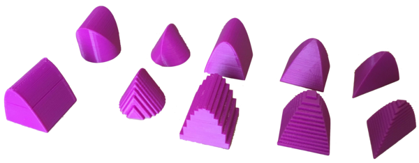

# Check-out at the MARC

## What are these?

Mathematics can be hard to visualize. To help with this, the mathematics department is printing 3D models to bring to life key concepts from calculus. Come play with weird surfaces, volumes, and so much more!

## Who are these for?

All tutors and students at the MARC are welcome to check out our models. The majority of the models are intended for the Calculus 2 and 3 curricula. Some models correspond to specific homework problems you might encounter.

## How do I check one out?

Ask the greeter if the model you would like is available to check out. If it is, the greeter will ask you to leave your student ID with them while you have the model. Please do not take the model out of the MARC. Be sure to collect your ID when you return the model. 

# HOWTO for MARC staff

## Checking out

1.  Locate the model the student wishes to check out. 

2.  Collect the student's Buff OneCard and place it in the pocket corresponding to the model they are checking out.

3.  Remind the student that the model must remain in the MARC at all times.

## Checking in

1.  Check that all pieces of the model are in the bag.

2.  Return the student's Buff OneCard.

## Lost? broken?

If an item is lost or broken, please email Danny Moritz at [daniel.moritz@colorado.edu](mailto:daniel.moritz@colorado.edu). Include the name of the model and a description of the damage. 
