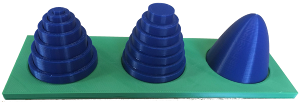


`{{ post.date | date: "%Y-%m-%d" }}` [{{ post.title }}](attached/{{ post.url }})


# Catalog of 3D models

## What are these?

> Mathematics can be hard to visualize. To help with this, the mathematics department at CU Boulder is printing 3D models to bring to life key concepts from calculus. Come play with weird surfaces, volumes, and so much more!

## Cross-sections

- Supports Stewart 6.2 Volumes of Solids by Cross Sections
- These are volumes with a specified base and cross-sections, together with their Riemann-sum approximations.
- Models generated by us using a Blender Python script. [Source here](attached/KnownCrossSections.py).

## Paraboloids

  

- Supports Stewart 6.2-6.3 Volumes of Solids of Revolution
- These models show the volume of a solid paraboloid being approximated using the disk and shell methods of integration.
- Models generated by us using a Blender Python script. [Source here](attached/SmoothDisksShells.py).

## Triangle parabola

- Supports Stewart 6.2 Exercise 43
- The base of the solid is the region enclosed by the parabola $y=1-x^2$ and the $x$-axis. The cross-sections perpendicular to the $x$-axis are isosceles triangles with height equal to the base.
- Model generated by us using a Blender Python script. [Source here](attached/KnownCrossSections.py).

## Wedge

- Supports Stewart 6.2 Exercise 46
- A wedge cut out of a circular cylinder of radius 4 by two planes. One plane is perpendicular to the axis of the cylinder. The other intersects the first at an angle of 30$^\circ$ along a diameter of the cylinder.
- Model generated by us using a Blender Python script. [Source here](attached/KnownCrossSections.py).

## Monkey Saddle

- Supports Stewart 11.7 Maximum and Minimum values
- A surface which a monkey can straddle with both legs and his tail. It is given by the equation $z=x^3-3xy^2$.
- The monkey saddle has a single critical point. The second derivative test is not sufficient to classify this critical point; it turns out to be a saddle point.

## Saddle

- Supports Stewart 11.7 Maximum and Minimum values
- The surface given by the equation $z=x^2-y^2$ has a critical point at the origin that is neither a relative maximum nor a relative minimum.
